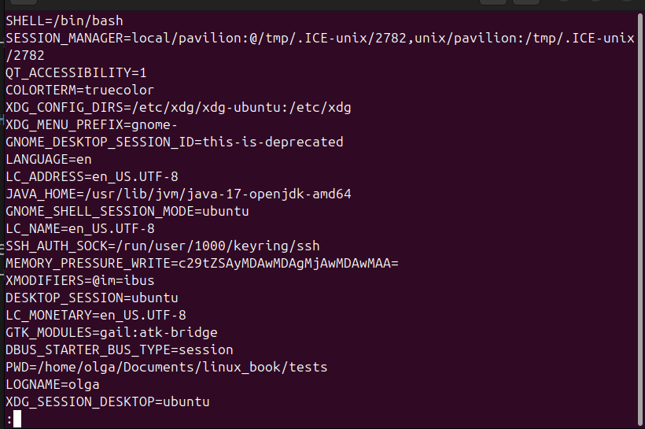
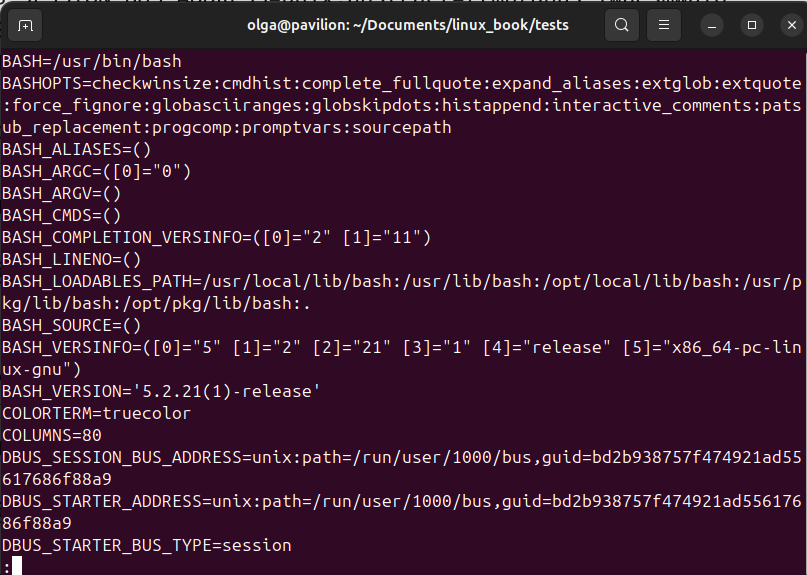
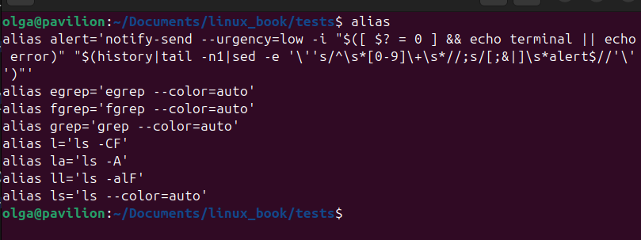
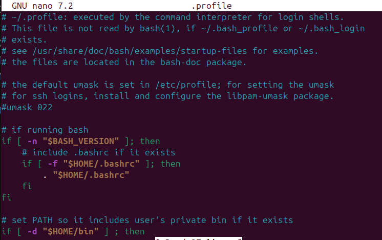

## Содержание

## Часть II Окружение и настройка
- [Глава 11. Окружение](#глава-1-окружение)

### Глава 11. Окружение

Командная оболочка на протяжении всего сеанса работы использует массу информации, которая называется окружением. Данные, хранящиеся в окружении, используются программами для выяснения деталей конфигурации системы. Даже притом, что для хранения своих настроек большинство программ использует конфигурационные файлы, некоторые программы также учитывают значения, хранящиеся в окружении. Зная это, можно использовать окружение для настройки некоторых параметров командной оболочки.

В этой главе мы будем работать со следующими командами:  

printenv — выводит часть или все окружение;  
set — устанавливает параметры командной оболочки;  
export — экспортирует окружение для программ, которые будут выполняться позднее;  
alias — создает псевдоним команды.  

### Что хранится в окружении?

Командная оболочка хранит в окружении данные двух основных типов - переменные командной оболочки и переменные окружения, хотя bash практически не делает различий между типами. Переменные командной оболочки — это фрагменты данных, инициализируемые командой bash, а переменные окружения — практически все остальное.

### Исследование окружения

Увидеть, что хранится в окружении, можно при помощи встроенной в bash команды set или программы printenv. 

Команда set выводит переменные обоих видов — командной оболочки и окружения, — тогда как printenv выводит только последние. Так как список содержимого окружения очень велик, его лучше просматривать, передавая вывод любой из команд через пайп в less:

printenv | less

Запустив эту команду, вы должны увидеть нечто похожее:

Это список переменных окружения с их значениями. Например, в списке можно увидеть переменную с именем USER, содержащую значение olga. Команда printenv может также вывести значение конкретной переменной:

Команда set при вызове без параметров и аргументов выводит переменные обоих типов — командной оболочки и окружения, — а также все объявленные функции командной оболочки.

set | less

Получить значение единственной переменной можно также с помощью команды echo, например:

Единственный элемент окружения, который не выводится командами set и printenv, это псевдонимы. Чтобы вывести список псевдонимов, используйте коман­ду alias без аргументов:

### Некоторые интересные переменные

Окружение содержит довольно много переменных, и хотя ваше окружение может отличаться от представленного здесь, вы почти наверняка увидите у себя переменные, перечисленные ниже.

Не волнуйтесь, если какие-то переменные у вас отсутствуют. Они могут отличаться в разных дистрибутивах.

### Как устанавливается окружение?

Когда мы входим в систему, запускается программа bash и читает содержимое серии конфигурационных сценариев, называемых файлами запуска (startup files), где определяется окружение по умолчанию, общее для всех пользователей. Затем она читает дополнительные файлы запуска в вашем домашнем каталоге, где
определяется личное окружение. Точная последовательность обработки файлов зависит от типа запускаемого сеанса командной оболочки. Сеансы работы с командной оболочкой входа могут быть двух типов.

* Сеанс командной оболочки входа (login shell session) — это сеанс, который на входе запрашивает имя пользователя и пароль, например, когда вход выполняется в виртуальной консоли.

* Сеанс простой командной оболочки (non-login shell session) обычно начинается, когда запускается терминал в графическом окружении.

Командные оболочки входа читают один или несколько файлов запуска, перечисленных ниже.

Обычные сеансы командной оболочки читают файлы, перечисленные ниже.

.bash_profile выполняется один раз при входе пользователя в систему (login shell). В этот файл обычно помещают настройки, которые должны происходить единожды при старте сессии, например настройка переменных окружения (PATH, EDITOR и т.п.). Он отвечает за конфигурацию среды именно при авторизации пользователя, например при входе в консоль или SSH

.bashrc выполняется при запуске каждого нового интерактивного терминала (non-login shell). Это значит, что если вы уже вошли в систему и открываете новое окно терминала, он выполнит команды из .bashrc. В этом файле обычно хранятся настройки для интерактивной работы — псевдонимы, функции, настройки приглашения командной строки и прочее, что нужно применять в каждом терминальном сеансе.

На практике часто делают так, чтобы .bash_profile вызывал .bashrc для загрузки настроек, чтобы не дублировать код:

if [ -f ~/.bashrc ]; then
  source ~/.bashrc
fi

Помимо чтения настроек из файлов запуска, перечисленных выше, обычные командные оболочки наследуют окружение от родительского процесса, каковым обычно является командная оболочка входа. С точки зрения обычного пользователя, файл ~/.bashrc является, пожалуй, самым важным файлом запуска, потому что его содержимое читается практически всегда. Обычные командные оболочки читают его по умолчанию, а большинство файлов запуска для командных оболочек входа написаны так, что оболочка также
прочитает файл ~/.bashrc.

### Что находится в файлах запуска?

Если заглянуть внутрь типичного файла .profile (Ubuntu), можно увидеть следующее:

Определение пользовательского окружения и запуск программ
PATH=$PATH:$HOME/bin
export PATH

Строки, начинающиеся с #, — это комментарии, они не читаются командной оболочкой, а предназначены для человека. Первый интересный фрагмент начинается сразу после комментариев:

if [ -f ~/.bashrc ]; then
. ~/.bashrc
fi 

Если файл ~/.bashrc существует, тогда прочитать файл ~/.bashrc file.

Важный момент!

Можно вызывать bashrc из profile, чтобы не дублировать настройки, что, в принципе, и показано выше.

Как видите, этот фрагмент вынуждает командную оболочку входа прочитать содержимое файла .bashrc. Следующая операция, выполняемая в файле запуска, имеет отношение к переменной PATH.

Приходилось ли вам задумываться над тем, как командная оболочка находит коман­ды, которые вводятся в командной строке? Например, когда мы вводим ls, командная оболочка не обыскивает весь компьютер целиком, чтобы найти /bin/ls (полный путь к команде ls), а просматривает только каталоги, перечисленные
в переменной PATH.

Переменная PATH часто (но не всегда, в зависимости от дистрибутива) устанавливается в файле запуска /.etc/profile, как показано ниже:

PATH=$PATH:$HOME/bin

Здесь в конец списка в переменной PATH добавляется каталог $HOME/bin. Этот код может служить примером использования механизма подстановки параметров, с которым мы познакомились ранее. 

Для демонстрации попробуйте выполнить следующий пример:  

[me@linuxbox ~]$ foo="This is some"  
[me@linuxbox ~]$ echo $foo  
This is some  
[me@linuxbox ~]$ foo=$foo" text."  
[me@linuxbox ~]$ echo $foo  
This is some text.  

Используя этот прием, можно добавлять текст в конец содержимого пере­менной. При добавлении строки $HOME/bin в конец содержимого переменной PATH происходит добавление каталога $HOME/bin в список каталогов, где будет выполняться поиск вводимых команд. Это означает, что если мы решим создать каталог в своем домашнем каталоге для хранения личных программ, командная оболочка уже будет готова к этому. Нам останется только дать имя bin этому каталогу.

### ПРИМЕЧАНИЕ

Многие дистрибутивы предоставляют настройки PATH по умолчанию. Некоторые дистрибутивы на основе Debian, такие как Ubuntu, проверяют наличие каталога ~/bin во время входа, и если он имеется, динамически добавляют его в переменную PATH.

Наконец, у нас осталась еще одна строка:  
export PATH  

Команда export указывает командной оболочке сделать содержимое переменной PATH доступным дочерним процессам этой оболочки.

### Изменение окружения

Теперь, зная, где находятся файлы запуска и что они содержат, мы можем изменить их, чтобы настроить окружение.

### Какие файлы следует изменять?

Как правило, изменение содержимого переменой PATH или определение дополнительных переменных окружения следует производить в файле .bash_profile (или эквивалентном ему, в зависимости от дистрибутива, — например, в Ubuntu используется файл .profile). Во всех остальных случаях изменения должны производиться в .bashrc.

### Текстовые редакторы

Для редактирования (то есть изменения) файлов запуска командной оболочки, а также большинства других конфигурационных файлов в системе используется программа, которая называется текстовым редактором. Текстовый редактор, подобно текстовому процессору, позволяет редактировать слова на экране, перемещая курсор. От текстового процессора эта программа отличается только поддержкой простого текста и нередко наличием особенностей, необходимых при разработке программ. Текстовые редакторы — основной инструмент, используемый программистами для создания программного кода и системными администраторами для управления конфигурационными файлами, определяющими настройки системы.

Текстовые редакторы делятся на две основные категории: с графическим и с текстовым интерфейсом. Оба окружения рабочего стола, GNOME и KDE, включают несколько популярных редакторов с графическим интерфейсом. В состав GNOME входит редактор с названием gedit, который в меню GNOME обычно
называется Text Editor (Текстовый редактор). Вместе с KDE обычно распространяется три редактора (в порядке увеличения сложности): kedit, kwrite и kate. Существует множество редакторов с текстовым интерфейсом. 

Наиболее популяр­ные из них, с которыми, возможно, вы столкнетесь: nano, vi и emacs. Редактор
nano — простой в использовании редактор, созданный как замена редактору pico, поставляемому в составе пакета программ для работы с электронной почтой PINE. Редактор vi (в большинстве систем Linux его замещает программа vim, название которой является сокращением от Vi IMproved (Vi улучшенный)) — традиционный редактор для Unix-подобных систем. 

### Использование текстового редактора

Любой текстовый редактор можно запустить из командной строки, введя имя редактора и имя файла, который требуется отредактировать. Если указанный файл не существует, редактор решит, что вы хотите создать новый файл. Ниже приводится пример использования gedit:

[me@linuxbox ~]$ gedit some_file

Эта команда запустит текстовый редактор gedit и загрузит в него файл с именем some_file, если таковой существует. Все текстовые редакторы с графическим интерфейсом имеют интуитивно понятный интерфейс, поэтому мы не будем описывать их здесь. Вместо этого сосредоточимся на редакторе с текстовым интерфейсом nano. Давайте запустим nano и внесем изменения в файл .bashrc. Но перед этим поговорим немного о мерах предосторожности. Всякий раз, собираясь редактировать важный конфигурационный файл, создайте сначала его резервную копию. Это обезопасит вас, если в процессе редактирования вы безнадежно испортите содержимое файла. 

Чтобы создать резервную копию файла .bashrc, выполните следующую команду:
[me@linuxbox ~]$ cp .bashrc .bashrc.bak

Неважно, как вы назовете файл с резервной копией; просто дайте ему такое имя, чтобы было понятно, что это за файл. Наиболее часто для имен файлов с резервными копиями используются расширения .bak, .sav, .old и .orig. Да, и не забудьте, что команда cp без лишних вопросов затирает существующие файлы.

### ВАЖНОСТЬ КОММЕНТАРИЕВ

Всякий раз, изменяя конфигурационные файлы, добавляйте краткие комментарии, описывающие эти изменения. Вне всяких сомнений, вы будете помнить назначение своих изменений завтра, но вспомните ли вы об этом через шесть месяцев? Сделайте себе подарок, добавьте несколько комментариев. Кроме того, хорошо бы завести файл журнала и в нем фиксировать произведенные изменения. Комментарии в сценариях на языке командной оболочки и в файлах запуска начинаются с символа #. В других конфигурационных файлах для этой цели могут использоваться другие символы. Комментарии можно найти в большинстве конфигурационных файлов. Используйте их как руководство.

### Активация изменений

Изменения, произведенные в файле .bashrc, не вступят в силу, пока вы не закроете терминал и не запустите новый, потому что оболочка читает содержимое файла .bashrc только в начале сеанса. Однако существует возможность принудить bash повторно прочитать измененный файл .bashrc следующей командой:

[me@linuxbox ~]$ source .bashrc

Например, в файл .bashrc можно добавить строку alias test='pwd –color=auto' как алиас, и после активауии изменений проверить работу алиаса таким образом: 

[me@linuxbox ~]$ test